# RESTooq - Sistema ERP Web

O **RESTooq** é um sistema ERP (**Enterprise Resource Planning**) desenvolvido como projeto **Full Stack**, com **frontend web** e **backend API REST**.

O sistema foi projetado para auxiliar pequenos negócios no controle de **estoque**, **clientes**, **vendas**, **devoluções** e **relatórios gerenciais**, além de possuir uma **área pública institucional** e uma **área privada protegida por autenticação**.

Este projeto foi desenvolvido durante minha formação Full Stack e representa meu principal projeto até o momento.

## Arquitetura do Sistema

O sistema foi dividido em duas partes principais:

### Frontend

- Angular 16
- TypeScript
- HTML
- SCSS
- Reactive Forms
- Angular Router
- HttpClient
- ng2-charts

O frontend possui:

**Área pública**

- Home
- Sobre
- FAQ
- Contato
- Login
- Cadastro

**Área autenticada**

- Dashboard
- Produtos
- Estoque
- PDV
- Pedidos
- Clientes
- Devoluções
- Relatórios

### Backend

O backend do projeto foi desenvolvido em duas etapas:

- Inicialmente, uma versão em **Node.js** com **Express**
- Posteriormente, a API principal foi refeita em **Java com Spring Boot**

Essa evolução permitiu ampliar a complexidade técnica do projeto, incluindo autenticação com JWT, persistência em banco relacional, validação de dados e organização em arquitetura em camadas.

**Arquitetura da API Java**

- `controllers`: expõem os endpoints HTTP
- `services`: concentram as regras de negócio
- `repositories`: fazem o acesso ao banco
- `entities`: representam as tabelas e relacionamentos

**Módulos implementados**

- Autenticação
- Usuários
- Produtos
- Pedidos
- Clientes
- Devoluções
- Dashboard
- Relatórios

## Funcionalidades

### Autenticação

- Login de usuários
- Autenticação com JWT
- Armazenamento de sessão
- Proteção de rotas

### Área Pública

- Página inicial institucional
- Página sobre
- FAQ
- Contato
- Cadastro de usuários

### Dashboard

- Indicadores de vendas
- Alertas de estoque
- Gráficos
- KPIs do sistema

### PDV

- Carrinho de compras
- Busca de produtos
- Cliente
- Pagamento com Dinheiro, Cartão e PIX
- Cálculo de troco
- Atalhos de teclado

### Produtos

- Cadastro de produtos
- SKU automático
- Cálculo de margem
- Cálculo de preço

### Estoque

- Listagem de produtos
- Filtro
- Paginação
- Exclusão

### Clientes

- Cadastro
- Listagem
- Edição
- Exclusão

### Pedidos

- Registro de vendas
- Paginação
- Exportação CSV
- Visualização de itens

### Devoluções

- Registro de devoluções
- Histórico de devoluções

### Relatórios

- Relatórios financeiros
- Filtros por período
- Dados resumidos

## Tecnologias Utilizadas

### Frontend

- Angular
- TypeScript
- HTML
- SCSS
- Bootstrap
- ng2-charts

### Backend

- Java
- Spring Boot
- Spring Web
- Spring Data JPA
- Hibernate
- Spring Validation
- Spring Security Crypto
- JWT
- MySQL
- Maven
- API REST

### Backend Inicial

- Node.js
- Express
- REST API

### Outras

- Git
- Arquitetura modular
- Reactive Forms
- JUnit 5
- Mockito

## Demonstração do Sistema

### Área Pública

### Home

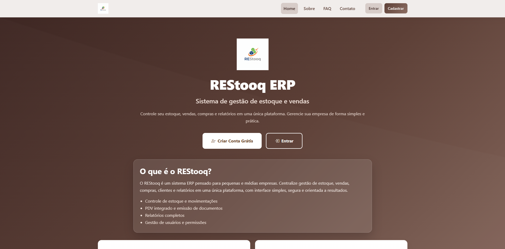

### Sobre

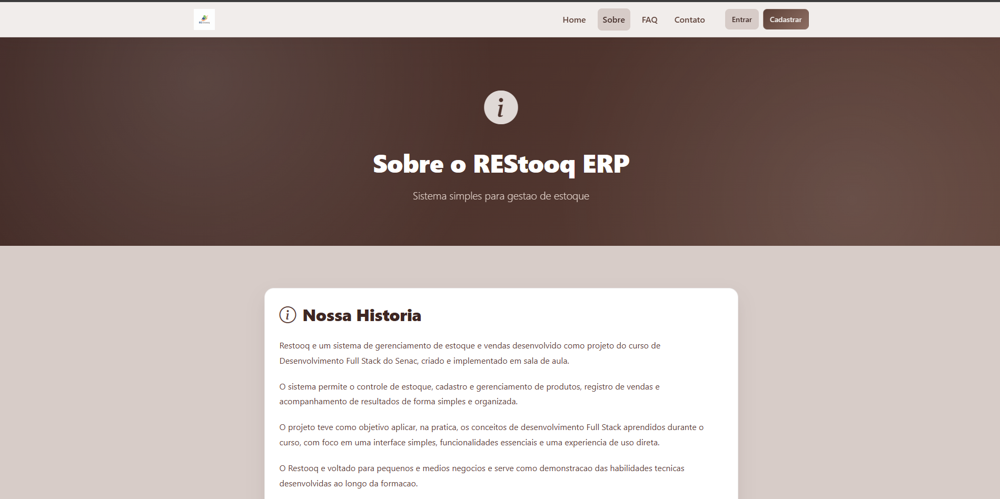

### FAQ

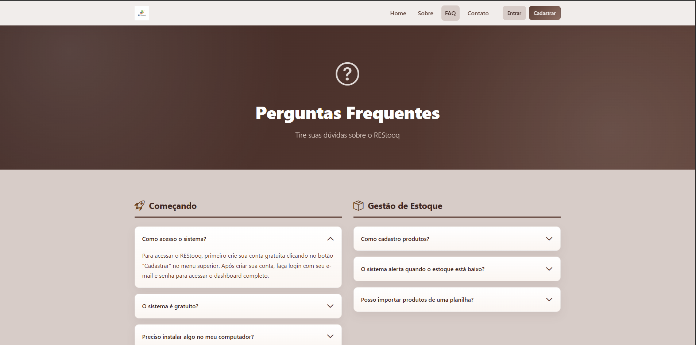

### Contato

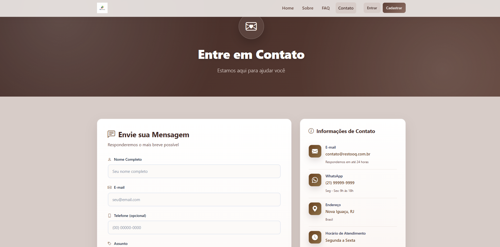

### Autenticação

### Login

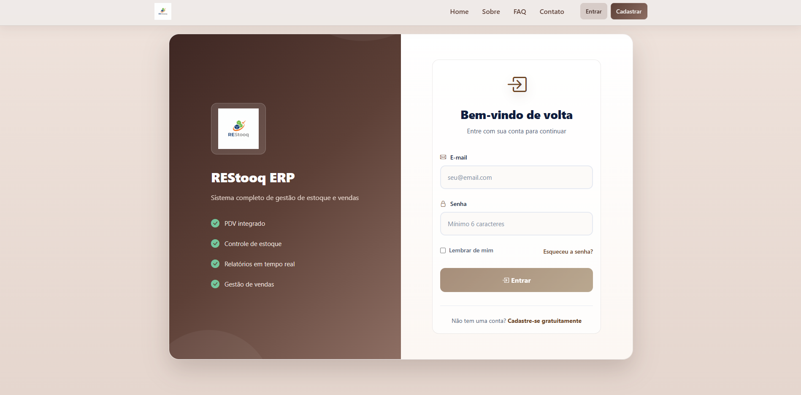

### Cadastro

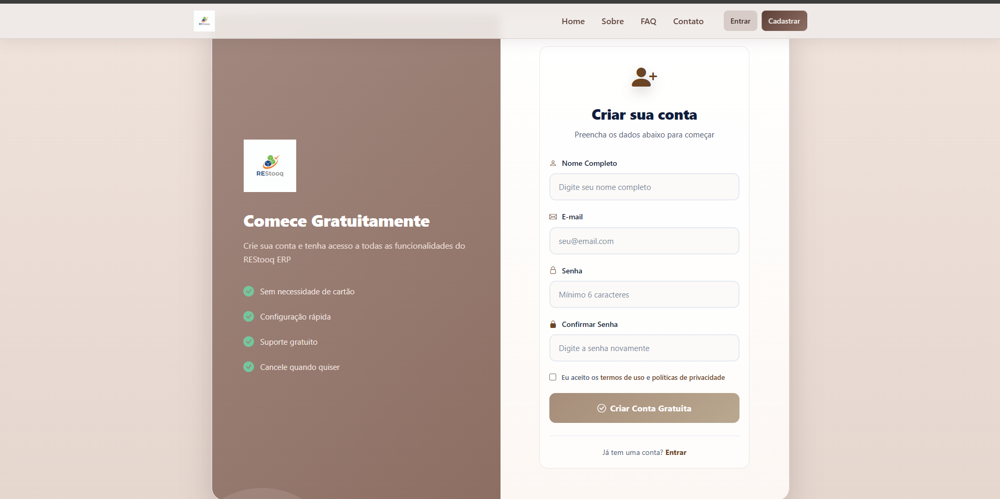

### Área Interna do ERP

### Dashboard

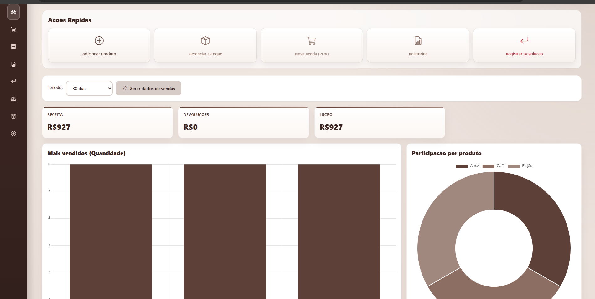

### Produtos

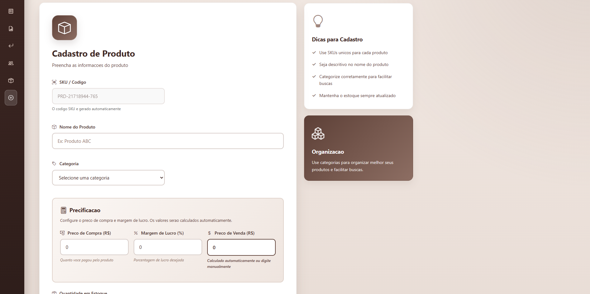

### Estoque

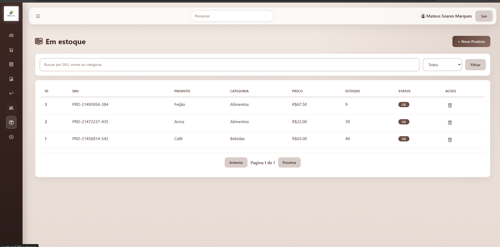

### PDV

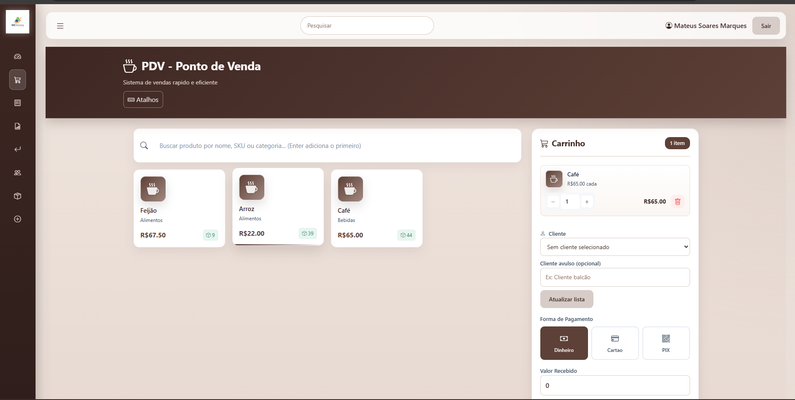

### Clientes

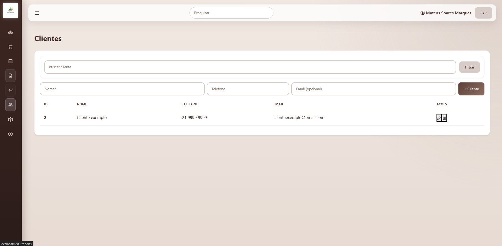

### Pedidos

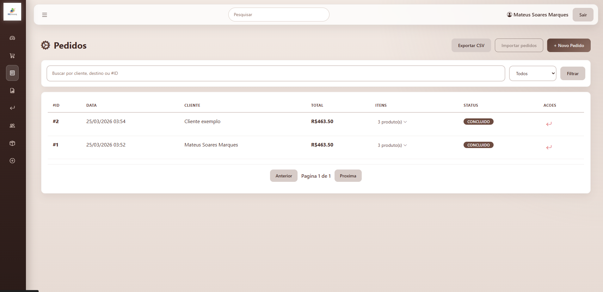

### Devoluções

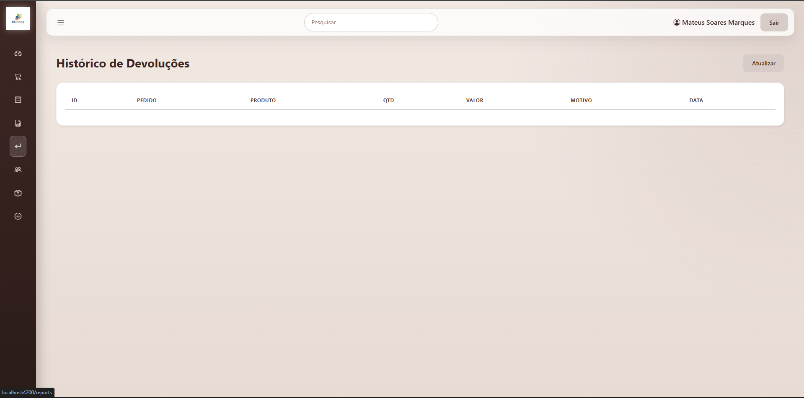

### Relatórios

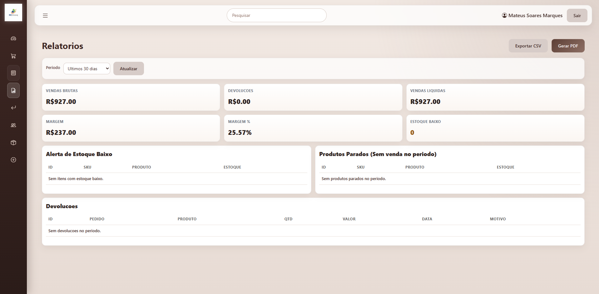

## Aprendizados

Durante o desenvolvimento deste projeto tive contato com:

- Desenvolvimento Full Stack
- Angular
- Node.js
- Java
- Spring Boot
- API REST
- JWT
- JPA / Hibernate
- MySQL
- Arquitetura de sistemas
- Estruturação de ERP
- Reactive Forms
- Integração frontend e backend
- Organização de projeto

## Estado Atual do Projeto

- Projeto concluído
- Frontend funcional com várias telas
- Backend iniciado em Node.js e posteriormente refeito em Java com Spring Boot
- API com autenticação JWT, persistência com MySQL e regras de negócio para estoque, pedidos e devoluções

## Estrutura do Projeto

```bash
src/
backend/
java-api/
images/
README.md
```

## Observação

Este projeto não está hospedado atualmente, pois depende de ambiente backend e banco configurados localmente.

As imagens acima demonstram o funcionamento completo do sistema.

## Autor

**Mateus Soares Marques**  
Desenvolvedor Full Stack Júnior

**GitHub**  
https://github.com/kodinne

**LinkedIn**  
https://www.linkedin.com/in/mateus-marques-bb1625285/
